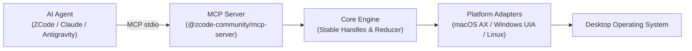

# zcode-desktop-control

> **Local-first desktop automation for AI agents, with first-class ZCode and MCP integration.**

[](LICENSE)
[](CHANGELOG.md)
[](package.json)
[](docs/PLATFORM_SUPPORT.md)
[](https://modelcontextprotocol.io/)

[**简体中文**](README.zh-CN.md) | [**Architecture**](docs/ARCHITECTURE.md) | [**Security Model**](docs/SECURITY_MODEL.md) | [**MCP Tools**](docs/MCP_TOOLS.md) | [**ZCode Integration**](docs/ZCODE_INTEGRATION.md)

---

## 1. Demo Walkthrough

`zcode-desktop-control` executes desktop actions semantically through native accessibility trees without displacing the user's cursor or stealing window focus.

```bash
# 1. Run diagnostic preflight
cua doctor

# 2. Inspect running desktop applications
cua list-apps

# 3. Start MCP server over stdio
cua mcp
```

For a full 30–60 second step-by-step video script, see [`docs/DEMO_SCRIPT.md`](docs/DEMO_SCRIPT.md).

---

## 2. Why zcode-desktop-control?

Existing desktop automation solutions for AI agents suffer from critical drawbacks:
- **Vision-Only Latency**: Relying on periodic full-screen screenshots inflates model token consumption and slows execution.
- **Fragile Volatile Indices**: Hardcoded element indices (`index: 12`) break on every dynamic repaint.
- **Opaque Proprietary Bloat**: Many existing implementations rely on closed-source binary daemons and proprietary protocols.

`zcode-desktop-control` delivers a **100% clean-room, local-first, accessibility-first** alternative engineered for reliability and safety.

---

## 3. Key Features

- **Accessibility-First**: Operates directly on native Accessibility (AX) trees. Actions are fast, pixel-accurate, and background-safe.
- **Stable Element Handles**: Resolves elements using deterministic content hashes (`h_<role>_<hash>`) based on hierarchy and identity, preventing stale reference drift.
- **Compact & Diff Observation**: Supports `detail="compact"` (pruning non-interactive noise) and `detail="diff"` (emitting only delta changes) to conserve model context.
- **Fail-Fast Error Taxonomy**: Granular error codes (`permission_denied`, `element_not_found`, `stale_handle`, `window_not_found`) enable self-healing agent loops.
- **Native ZCode Plugin**: Ready-to-use `.zcode-plugin/plugin.json` and concise `computer-use` agent skill.
- **Universal MCP Server**: Seamlessly connects to Antigravity, Claude Code, Cursor, Codex, or custom agents.
- **Zero Proprietary Binaries**: Pure open-source TypeScript architecture.

---

## 4. Architecture



See [`docs/ARCHITECTURE.md`](docs/ARCHITECTURE.md) for detailed technical specifications.

---

## 5. Quick Start (5 Minutes)

### Prerequisites
- Node.js >= 20.0.0
- pnpm >= 9.0.0

```bash
# 1. Clone repository
git clone https://github.com/timexingxin/zcode-desktop-control.git
cd zcode-desktop-control

# 2. Install and build
pnpm install
pnpm build

# 3. Verify health
pnpm doctor
```

---

## 6. ZCode Installation

Register the plugin into your ZCode installation:

```bash
# Option A: Via ZCode CLI
zcode plugin link ./plugin

# Option B: Symlink to user plugin data directory
mkdir -p ~/.zcode/cli/plugins/data/zcode-desktop-control
ln -s "$(pwd)/plugin" ~/.zcode/cli/plugins/data/zcode-desktop-control
```

See [`docs/ZCODE_INTEGRATION.md`](docs/ZCODE_INTEGRATION.md) for full configuration details.

---

## 7. Connecting to Other MCP Clients

Add the server to your client's MCP configuration (`mcp_config.json`):

```json
{
  "mcpServers": {
    "computer-use": {
      "command": "node",
      "args": [
        "/path/to/zcode-desktop-control/packages/mcp-server/dist/bin/server.js"
      ]
    }
  }
}
```

Compatible with:
- **Claude Code** (`claude mcp add ...`)
- **Antigravity**
- **Cursor**
- **Hermes / Codex**

---

## 8. Tool Examples

### Observing App State (Compact)
```json
{
  "name": "get_app_state",
  "arguments": {
    "app_ref": { "name": "Notes" },
    "detail": "compact"
  }
}
```

### Clicking an Element by Stable Handle
```json
{
  "name": "click",
  "arguments": {
    "target": {
      "type": "element",
      "state_id": "s_1a2b3c4d",
      "handle": "h_button_e5f6g7"
    }
  }
}
```

### Setting Text Value Semantically
```json
{
  "name": "set_value",
  "arguments": {
    "target": { "type": "element", "handle": "h_textfield_09876" },
    "value": "Meeting Notes 2026-09-21"
  }
}
```

See [`docs/MCP_TOOLS.md`](docs/MCP_TOOLS.md) for all 30+ tool signatures.

---

## 9. Platform Support

| Platform | Automation Layer | Status |
| :--- | :--- | :---: |
| **macOS (arm64)** | Accessibility (AX), System Events, CoreGraphics | **Tested & Verified** |
| **macOS (x64)** | Accessibility (AX), System Events, CoreGraphics | **Supported** |
| **Windows (x64)** | Windows UI Automation & PowerShell | **Architecturally Prepared** |
| **Linux (X11 / Wayland)** | AT-SPI2 / Portal | **Experimental** |

See [`docs/PLATFORM_SUPPORT.md`](docs/PLATFORM_SUPPORT.md) for environment details.

---

## 10. Security & Privacy

- **Local-Only**: Binds exclusively to stdio or `127.0.0.1`.
- **Zero Credential Access**: Strictly barred from browser cookies, password managers, and OS Keychains.
- **Sensitive Field Redaction**: Password inputs are automatically masked in tree snapshots.
- **Emergency Kill Switch**: `stop_computer_control` halts automation immediately.

See [`docs/SECURITY_MODEL.md`](docs/SECURITY_MODEL.md).

---

## 11. Development & Testing

```bash
# Run type checks
pnpm run typecheck

# Run test suite
pnpm run test

# Run code style linter
pnpm run lint
```

See [`docs/DEVELOPMENT.md`](docs/DEVELOPMENT.md).

---

## 12. Roadmap

See [`ROADMAP.md`](ROADMAP.md) for upcoming features, including Linux Wayland enhancements and multi-monitor DPI scaling.

---

## 13. Contributing

Contributions are welcomed under the Apache-2.0 License. Please read [`CONTRIBUTING.md`](CONTRIBUTING.md) and [`CODE_OF_CONDUCT.md`](CODE_OF_CONDUCT.md) before opening a pull request.

---

## 14. License

Distributed under the [Apache-2.0 License](LICENSE).  
Third-party notices are documented in [`THIRD_PARTY_NOTICES.md`](THIRD_PARTY_NOTICES.md).

---

## 15. Disclaimer

> **Notice**: This is an independent community project and is not affiliated with, sponsored by, or endorsed by Z.ai or Beijing Knowledge Atlas Technology Joint Stock Company Limited. "ZCode" is a trademark of its respective owner.
