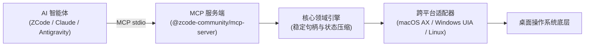

# zcode-desktop-control

> **面向 AI 智能体的本地优先桌面自动化运行时，提供一流的 ZCode 与 MCP 协议集成。**

[](LICENSE)
[](CHANGELOG.md)
[](package.json)
[](docs/PLATFORM_SUPPORT.md)
[](https://modelcontextprotocol.io/)

[**English**](README.md) | [**架构设计**](docs/ARCHITECTURE.md) | [**安全模型**](docs/SECURITY_MODEL.md) | [**MCP 工具清单**](docs/MCP_TOOLS.md) | [**ZCode 集成指南**](docs/ZCODE_INTEGRATION.md)

---

## 1. 快速演示

`zcode-desktop-control` 通过操作系统底层的无障碍语义树（Accessibility / AX）执行桌面控制，在后台精准完成点击与输入，不抢占物理鼠标光标，不破坏用户焦点。

```bash
# 1. 运行系统环境与权限诊断
cua doctor

# 2. 查询当前正在运行的桌面应用
cua list-apps

# 3. 启动标准 stdio MCP 服务
cua mcp
```

详细的 30–60 秒视频录制脚本请参阅 [`docs/DEMO_SCRIPT.md`](docs/DEMO_SCRIPT.md)。

---

## 2. 为什么选择 zcode-desktop-control？

现有针对智能体的桌面控制方案普遍存在以下痛点：
- **纯视觉延迟与 Token 膨胀**：频繁抓取全屏截图极度消耗上下文，且难以处理高分辨率动态界面。
- **脆弱的易变索引**：依赖简单整数索引（`index: 12`）在界面轻微刷新后便迅速失效，导致误触。
- **闭源专有依赖**：官方或传统实现多捆绑未经开源的商业二进制守护进程与专有 IPC 协议。

`zcode-desktop-control` 采用 **100% Clean-Room 独立设计**，为开发者提供一个透明、轻量、安全且高性能的桌面控制基座。

---

## 3. 核心特性

- **Accessibility 优先**：深度利用原生无障碍语义树，语义点击与值写入不抢占鼠标指针，后台执行更平稳。
- **稳定元素句柄（Stable Handles）**：依据窗口 ID、控件角色、名称及层级路径生成唯一哈希标识（`h_<role>_<hash>`），规避界面重绘导致的索引偏移。
- **Compact 与 Diff 压缩观测**：提供 `compact` 瘦身模式（过滤无动作装饰容器）与 `diff` 差分模式（仅传输变更节点），大幅降低 LLM 上下文开销。
- **结构化错误分类体系**：明确区分 `permission_denied`、`element_not_found`、`stale_handle`、`window_not_found` 与 `timeout`，赋能 Agent 智能自愈重试。
- **官方 ZCode 插件就绪**：提供符合规范的 `.zcode-plugin/plugin.json` 清单与精简高质的 `computer-use` Agent 技能。
- **通用 MCP 标准服务**：可无缝接入 Antigravity、Claude Code、Cursor、Codex 或任何 MCP 客户端。
- **零商业闭源二进制**：纯纯净的 TypeScript 工程化实现，开源合规安全。

---

## 4. 系统架构



详细架构说明与数据流向见 [`docs/ARCHITECTURE.md`](docs/ARCHITECTURE.md)。

---

## 5. 快速上手 (5 分钟)

### 环境要求
- Node.js >= 20.0.0
- pnpm >= 9.0.0

```bash
# 1. 克隆代码仓库
git clone https://github.com/timexingxin/zcode-desktop-control.git
cd zcode-desktop-control

# 2. 安装依赖并编译构建
pnpm install
pnpm build

# 3. 运行环境与权限健康检查
pnpm doctor
```

---

## 6. ZCode 插件安装

将本插件注册至您的 ZCode 运行环境：

```bash
# 方式一：通过 ZCode 命令行链接插件目录
zcode plugin link ./plugin

# 方式二：建立符号链接至用户插件数据目录
mkdir -p ~/.zcode/cli/plugins/data/zcode-desktop-control
ln -s "$(pwd)/plugin" ~/.zcode/cli/plugins/data/zcode-desktop-control
```

详细说明请查阅 [`docs/ZCODE_INTEGRATION.md`](docs/ZCODE_INTEGRATION.md)。

---

## 7. 接入其他 MCP 客户端

在客户端的 `mcp_config.json` 中配置即可：

```json
{
  "mcpServers": {
    "computer-use": {
      "command": "node",
      "args": [
        "/path/to/zcode-desktop-control/packages/mcp-server/dist/bin/server.js"
      ]
    }
  }
}
```

完美兼容：
- **Claude Code** (`claude mcp add ...`)
- **Antigravity**
- **Cursor**
- **Codex / Hermes**

---

## 8. 工具调用示例

### 获取应用精简状态（Compact 模式）
```json
{
  "name": "get_app_state",
  "arguments": {
    "app_ref": { "name": "备忘录" },
    "detail": "compact"
  }
}
```

### 通过稳定句柄精准点击控件
```json
{
  "name": "click",
  "arguments": {
    "target": {
      "type": "element",
      "state_id": "s_1a2b3c4d",
      "handle": "h_button_e5f6g7"
    }
  }
}
```

### 语义化写入文本内容
```json
{
  "name": "set_value",
  "arguments": {
    "target": { "type": "element", "handle": "h_textfield_09876" },
    "value": "2026年9月项目总结"
  }
}
```

全部 30 项工具签名请见 [`docs/MCP_TOOLS.md`](docs/MCP_TOOLS.md)。

---

## 9. 平台支持现状

| 操作系统 | 自动化技术实现 | 支持状态 |
| :--- | :--- | :---: |
| **macOS (arm64)** | Accessibility (AX)、System Events、CoreGraphics | **已实测验证 (Tested)** |
| **macOS (x64)** | Accessibility (AX)、System Events、CoreGraphics | **已支持 (Supported)** |
| **Windows (x64)** | Windows UI Automation 与 PowerShell | **架构就绪 (Prepared)** |
| **Linux (X11 / Wayland)** | AT-SPI2 与 Portal 机制 | **实验性 (Experimental)** |

详细验证环境见 [`docs/PLATFORM_SUPPORT.md`](docs/PLATFORM_SUPPORT.md)。

---

## 10. 安全与隐私约束

- **本地优先**：严格限定于 stdio 或 `127.0.0.1`，绝不静默暴露公网。
- **拒绝凭据窃取**：严禁刺探浏览器 Cookie、用户密码管理器或系统钥匙串。
- **敏感字段自动脱敏**：密码输入框（`secureTextField`）内容在状态快照中强制显示为 `[REDACTED_PASSWORD]`。
- **紧急熔断机制**：提供 `stop_computer_control` 一键终止自动化控制。

详见 [`docs/SECURITY_MODEL.md`](docs/SECURITY_MODEL.md)。

---

## 11. 开发与测试

```bash
# 执行类型检查
pnpm run typecheck

# 运行全套自动化测试
pnpm run test

# 运行代码规范检查
pnpm run lint
```

二次开发指南见 [`docs/DEVELOPMENT.md`](docs/DEVELOPMENT.md)。

---

## 12. 演进路线

后续版本规划请参见 [`ROADMAP.md`](ROADMAP.md)。

---

## 13. 开源贡献

欢迎提交 Issue 与 Pull Request。参与前请查阅 [`CONTRIBUTING.md`](CONTRIBUTING.md) 与 [`CODE_OF_CONDUCT.md`](CODE_OF_CONDUCT.md)。

---

## 14. 许可证

基于 [Apache-2.0 开源许可证](LICENSE) 发布。第三方声明见 [`THIRD_PARTY_NOTICES.md`](THIRD_PARTY_NOTICES.md)。

---

## 15. 免责声明

> **注意**：本项目为独立的社区开源项目，与 Z.ai 或北京智谱华章科技有限公司无隶属、赞助或背书关系。“ZCode”商标归其相应所有者所有。
