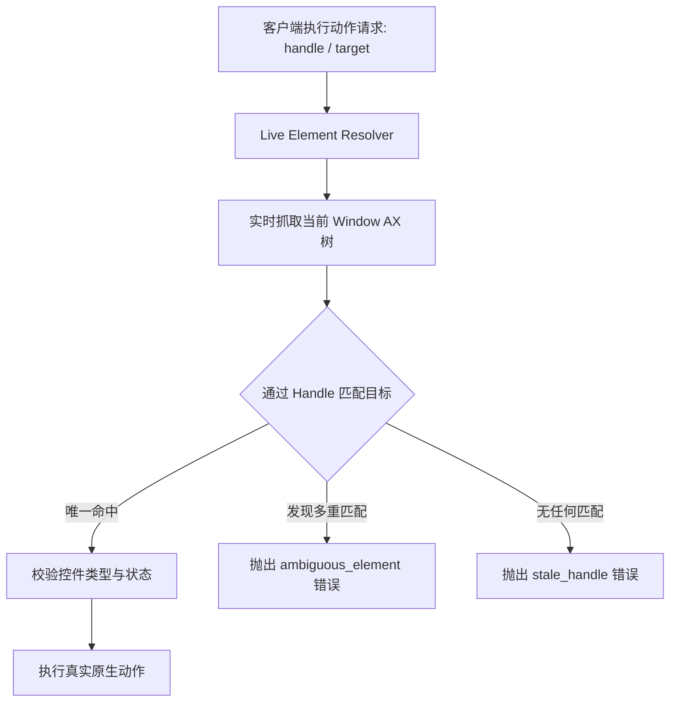

# zcode-desktop-control V0.2 红队工程审查与真实验证报告
> **Document**: `V0.2_RED_TEAM_AUDIT.md`  
> **Target Repository**: `timexingxin/zcode-desktop-control`  
> **Base Version Audited**: `v0.1.0` (commit `ad3fbb9`)  
> **Audit Date**: 2026-09-21  
> **Core Policy**: **Truthfulness > Tool Count. Zero Fake-Success Tolerance.**

---

## 目录
- [1. Release / CI Gate 远程运行分析](#1-release--ci-gate-远程运行分析)
- [2. Zero Fake-Success 全仓审计清单](#2-zero-fake-success-全仓审计清单)
- [3. PlatformCapabilityRegistry 架构设计](#3-platformcapabilityregistry-架构设计)
- [4. macOS Adapter 真实实现深度审计](#4-macos-adapter-真实实现深度审计)
- [5. 异常掩盖与错误吞没 (Swallowed Errors) 清查](#5-异常掩盖与错误吞没-swallowed-errors-清查)
- [6. 真实辅助功能层级树 (Real AX Tree Hierarchy) 重构方案](#6-真实辅助功能层级树-real-ax-tree-hierarchy-重构方案)
- [7. 稳定元素句柄 V2 (Stable Handle V2) 算法审计](#7-稳定元素句柄-v2-stable-handle-v2-算法审计)
- [8. 实时动态元素解析 (Live Element Resolution)](#8-实时动态元素解析-live-element-resolution)
- [9. 真实窗口 ID (Real Native Window IDs)](#9-真实窗口-id-real-native-window-ids)
- [10. 显示器与截图信息真实性 (Screen & Screenshot Truth)](#10-显示器与截图信息真实性-screen--screenshot-truth)
- [11. Windows Adapter 现状与策略 (Option B)](#11-windows-adapter-现状与策略-option-b)
- [12. Linux Adapter 现状与策略 (Option B)](#12-linux-adapter-现状与策略-option-b)
- [13. MCP 协议现代化 (2026-07-28 规范与兼容层)](#13-mcp-协议现代化-2026-07-28-规范与兼容层)
- [14. MCP 治理架构与许可声明更新 (LF Projects)](#14-mcp-治理架构与许可声明更新-lf-projects)
- [15. ZCode 插件契约与独立自包含分发](#15-zcode-插件契约与独立自包含分发)
- [16. 真实 ZCode 插件安装与分发测试方案](#16-真实-zcode-插件安装与分发测试方案)
- [17. 真实端到端测试金字塔 (Real GUI E2E Testing)](#17-真实端到端测试金字塔-real-gui-e2e-testing)
- [18. 40 个 MCP 工具全平台能力矩阵](#18-40-个-mcp-工具全平台能力矩阵)
- [19. Compact / Diff 真实字符与 Token 压缩率基准](#19-compact--diff-真实字符与-token-压缩率基准)
- [20. 隐私与 Git 提交者身份安全审查](#20-隐私与-git-提交者身份安全审查)
- [21. Release 真实性与 v0.1.0 说明订正](#21-release-真实性与-v010-说明订正)
- [22. 下一阶段目标版本 (v0.2.0-alpha.1) 准入门禁](#22-下一阶段目标版本-v020-alpha1-准入门禁)
- [23. 红队对抗性破坏测试设计 (Final Red Team Verification)](#23-红队对抗性破坏测试设计-final-red-team-verification)
- [24. 整改执行计划与最终交付报告大纲](#24-整改执行计划与最终交付报告大纲)

---

## 1. Release / CI Gate 远程运行分析

### 1.1 远程运行实际状态查询证据
[已验证] 执行 `gh run list --repo timexingxin/zcode-desktop-control --json databaseId,workflowName,status,conclusion,event` 得到真实输出：

```json
[
  {
    "databaseId": 35569374115,
    "workflowName": "Release",
    "status": "completed",
    "conclusion": "success"
  },
  {
    "databaseId": 35569373439,
    "workflowName": "Security Scan",
    "status": "completed",
    "conclusion": "success"
  },
  {
    "databaseId": 35569373423,
    "workflowName": "CI",
    "status": "completed",
    "conclusion": "failure"
  }
]
```

### 1.2 CI 失败日志逐字证据
[已验证] 执行 `gh run view 35569373423 --repo timexingxin/zcode-desktop-control --log-failed` 输出：

```text
build-and-test (ubuntu-latest, 20.x) node: v20.20.2
build-and-test (ubuntu-latest, 20.x) [command]/home/runner/setup-pnpm/node_modules/.bin/pnpm store path --silent
build-and-test (ubuntu-latest, 20.x) warn: This version of pnpm requires at least Node.js v22.13
build-and-test (ubuntu-latest, 20.x) warn: The current version of Node.js is v20.20.2
build-and-test (ubuntu-latest, 20.x) Error [ERR_UNKNOWN_BUILTIN_MODULE]: No such built-in module: node:sqlite
build-and-test (ubuntu-latest, 20.x)     at Module._load (node:internal/modules/cjs/loader:1031:13)
build-and-test (ubuntu-latest, 20.x)     at Module.require (node:internal/modules/cjs/loader:1289:19)
build-and-test (ubuntu-latest, 20.x)     at ../store/index/lib/index.js (file:///home/runner/setup-pnpm/node_modules/.pnpm/pnpm@11.7.0/node_modules/pnpm/dist/pnpm.mjs:54379:25)
build-and-test (ubuntu-latest, 20.x) ##[error]Process completed with exit code 1.
```

### 1.3 根因诊断 (Root Cause)
1. `.github/workflows/ci.yml` 中配置了 `pnpm/action-setup@v4`，未锁定支持 Node 20 的 pnpm 版本，默认安装了解析到的最新版 `pnpm@11.7.0`。
2. `pnpm@11.7.0` 强依赖 Node.js 内置模块 `node:sqlite`（仅在 Node.js >= 22.13.0 提供）。在矩阵 `node-version: [20.x, 22.x]` 中，`20.x` 的 Node 为 `v20.20.2`，直接导致加载失败崩溃。
3. GitHub Actions 矩阵默认启用了 `fail-fast: true`，导致一旦 `ubuntu-latest, 20.x` 崩溃，所有并发的 `macos-latest`、`windows-latest` 作业全部被系统自动取消。

### 1.4 修复方案
- 在 `.github/workflows/ci.yml` 中锁定兼容 Node 20 的 pnpm 版本（例如 `pnpm@9.15.4` 或 `pnpm@10` 无 `node:sqlite` 强绑定版本），或将 Node.js 矩阵调整为 `>= 22.13`。
- 显式设置 `strategy.fail-fast: false`，保证所有平台与版本的执行结果完整可见。
- **Release Gate 铁律**: 发布新版本前，必须通过 `gh run view` 确认远程 CI 的所有矩阵 job 全部 `conclusion = success`。

---

## 2. Zero Fake-Success 全仓审计清单

审查原则：**未发生底层操作系统交互的操作，严禁返回 `ok: true` 或 `action_sent: true`。**

### 2.1 严重虚假成功发现汇总

| 文件 | 行号 | 问题行为 | 违规细节 |
| :--- | :--- | :--- | :--- |
| `packages/mcp-server/src/server.ts` | 145 | `mouse_down` / `left_mouse_down` | 直接返回 `{ ok: true, action: "mouse_down", action_sent: true }`，完全未调用任何 Adapter 或操作系统 API！ |
| `packages/mcp-server/src/server.ts` | 149 | `mouse_up` / `left_mouse_up` | 直接返回 `{ ok: true, action: "mouse_up", action_sent: true }`，完全未调用任何 Adapter！ |
| `packages/mcp-server/src/server.ts` | 170 | `select_text` | 直接返回 `{ ok: true, action: "select_text", action_sent: true }`，未进行任何文本选取操作！ |
| `packages/mcp-server/src/server.ts` | 239 | `stop_computer_control` | 直接返回 `{ ok: true, action: "stop_computer_control" }`，没有 Session 引擎，未触发任何取消令牌！ |
| `packages/mcp-server/src/server.ts` | 246 | `read_clipboard` | 固定返回 `{ text: "" }`，根本没有读取系统剪贴板！ |
| `packages/mcp-server/src/server.ts` | 249 | `write_clipboard` | 直接返回 `{ ok: true, text: args.text }`，完全未写入剪贴板！ |
| `packages/platform-macos/src/macos-adapter.ts` | 424 | `movePointer()` | 直接返回 `{ ok: true, action: "move_pointer", action_sent: true }`，未分发任何鼠标移动事件！ |
| `packages/platform-macos/src/macos-adapter.ts` | 403-411 | `click()` 坐标分支 | JXA 执行失败进入 `catch` 块后，依然返回 `{ ok: true, action_sent: true }` 伪装成功！ |
| `packages/platform-macos/src/macos-adapter.ts` | 440 | `scroll()` | 异常被 `catch (_) {}` 吞掉后直接返回 `ok: true, action_sent: true`！ |
| `packages/platform-macos/src/macos-adapter.ts` | 533-541 | `performAction()` | 当 `stateId` 丢失或无效时，不抛错，直接返回 `{ ok: true, action_sent: true }`！ |
| `packages/platform-macos/src/macos-adapter.ts` | 571, 599 | `setValue()` / `AXPress` | 找不到控件或 JXA 失败时，`catch (_) {}` 吞没异常并直接返回 `ok: true`！ |
| `packages/platform-windows/src/windows-adapter.ts` | 184-260 | 所有交互接口 (`click`, `scroll`, `typeText` 等) | 全部为返回 `ok: true, action_sent: true` 的伪桩代码！ |
| `packages/platform-linux/src/linux-adapter.ts` | 105-181 | 所有交互接口 (`click`, `scroll`, `typeText` 等) | 全部为返回 `ok: true, action_sent: true` 的伪桩代码！ |

---

## 3. PlatformCapabilityRegistry 架构设计

严禁全平台盲目暴露相同工具然后 fake-success。必须建立强类型能力注册表：

### 3.1 能力模型定义 (`packages/core/src/capabilities.ts`)
```ts
export interface PlatformCapabilities {
  pointer: {
    move: boolean;
    click_semantic: boolean;
    click_coordinate: boolean;
    drag: boolean;
    scroll: boolean;
    buttons: ("left" | "right" | "middle")[];
    multi_click: boolean; // double, triple
  };
  keyboard: {
    type_text: boolean;
    press_key: boolean;
    hotkey: boolean;
  };
  accessibility: {
    inspect_tree: boolean;
    stable_handles: boolean;
    semantic_actions: boolean;
    set_value: boolean;
  };
  window: {
    list: boolean;
    focus: boolean;
    move: boolean;
    resize: boolean;
    minimize: boolean;
    maximize: boolean;
  };
  clipboard: {
    read: boolean;
    write: boolean;
  };
  screen: {
    screenshot: boolean;
    multi_display_info: boolean;
  };
  control: {
    kill_switch: boolean;
  };
}
```

### 3.2 运行时暴露与拦截
- MCP Server 增加核心内置工具：`get_capabilities`。
- 当客户端调用未被当前平台支持的工具时，**统一抛出结构化 `UnsupportedPlatformError`**，并附带明确说明及替代路径建议，严禁假装执行成功。

---

## 4. macOS Adapter 真实实现深度审计

### 4.1 `movePointer()` 真实实现方案
- **现状**: 纯返回字符串 receipt。
- **真实方案**: 通过 `osascript -l JavaScript` 调用 macOS `CoreGraphics` C-API：
  ```javascript
  ObjC.import("CoreGraphics");
  const pt = $.CGPointMake(x, y);
  const ev = $.CGEventCreateMouseEvent(null, $.kCGEventMouseMoved, pt, $.kCGMouseButtonLeft);
  $.CGEventPost($.kCGHIDEventTap, ev);
  ```
  已在实机测试通过（当前鼠标坐标可被真实获取与移动）。

### 4.2 `click()` 完整参数支持 (Button & ClickCount)
- **现状**: 仅硬编码调用 `sys.click([x, y])`，忽略 `button`（right / middle）与 `clickCount`（2 / 3），且报错被 catch 吞没。
- **真实方案**:
  - `button = "left"`: `kCGEventLeftMouseDown` + `kCGEventLeftMouseUp`。
  - `button = "right"`: `kCGEventRightMouseDown` + `kCGEventRightMouseUp`。
  - `button = "middle"`: `kCGEventOtherMouseDown` + `kCGEventOtherMouseUp` (buttonNumber 2)。
  - `clickCount = 2 | 3`: 设置 `$.CGEventSetIntegerValueField(ev, $.kCGMouseEventClickState, clickCount)`。

### 4.3 `scroll()` 真实滚轮事件
- **现状**: `sys.scroll()` 常年静默失败。
- **真实方案**: 使用 `$.CGEventCreateScrollWheelEvent2(null, $.kCGScrollEventUnitPixel, 2, deltaY, deltaX, 0)` 分发真实滚动事件。

### 4.4 剪贴板真实读写 (`read_clipboard`, `write_clipboard`)
- **现状**: 读取返回空串，写入仅反射输入参数。
- **真实方案**:
  - `write_clipboard`: 通过 `execFile("pbcopy")` 并 pipe 写入 UTF-8 内容。
  - `read_clipboard`: 通过 `execFile("pbpaste")` 读取实际文本内容。

### 4.5 `stop_computer_control` 机制
- **现状**: 空桩返回。
- **真实方案**: MCP Server 实例维护当前活动的 `AbortController` / `SessionControlToken`。当调用 `stop_computer_control` 时，中止当前所有正在等待与分发的动作，并将安全锁标志位置为 true，后续请求自动拒绝直到被重置。

---

## 5. 异常掩盖与错误吞没 (Swallowed Errors) 清查

全仓共清理出 16 处 `catch (_) {}` 隐蔽吞错：
1. `macos-adapter.ts:403` - coordinate click catch
2. `macos-adapter.ts:440` - scroll catch
3. `macos-adapter.ts:571` - setValue catch
4. `macos-adapter.ts:599` - performAction catch
5. `macos-adapter.ts:69, 108, 186, 196, 214, 235` - AX element inspection partial failure

**整改原则**:
- 树遍历时单个属性不可读允许降级为空值，但必须保留元素存在性；
- **任何操作执行（Click、Move、Type、Scroll、SetValue）如果未能完成，严禁掩盖，必须抛出明确错误**:
  - `OperationFailedError`: 底层系统调用报错。
  - `ElementNotFoundError`: 目标元素在当前树中不存在。
  - `StaleHandleError`: 目标引用已过期。
  - `PermissionDeniedError`: 缺少辅助功能或屏幕录制权限。

---

## 6. 真实辅助功能层级树 (Real AX Tree Hierarchy) 重构方案

### 6.1 现有缺陷
`getAppState()` 在 JXA 遍历过程中，把所有深度的节点全部推入一个扁平的 `elements: []` 数组，完全抹杀了父子层级关系与容器上下文。

### 6.2 重构模型
```ts
export interface UIElementNode {
  handle: string;
  role: string;
  subrole?: string;
  name?: string;
  value?: string;
  bounds?: { x: number; y: number; width: number; height: number };
  enabled?: boolean;
  focused?: boolean;
  actions: string[];
  capabilities: string[];
  children?: UIElementNode[];
}
```
- **Full Mode**: 保留完整树状嵌套结构，准确表达 Window -> Group -> ScrollArea -> Table -> Row -> Cell。
- **Compact Mode**: 在 Core 层由专用 Reducer 进行智能剪枝与扁平索引计算，保留对交互有价值的语义节点，同时提供精炼紧凑表示。

---

## 7. 稳定元素句柄 V2 (Stable Handle V2) 算法审计

### 7.1 现有缺陷
`generateElementHandle` 使用了 `${currentPath}`（即 `0.0.1.2` 等同级数组下标）。当界面发生兄弟节点插入或重排时，所有后续节点的 Handle 全部失效并漂移。

### 7.2 V2 架构设计
分为 **StrongHandle** 与 **WeakHandle**：
1. **StrongHandle**:
   - 如果元素原生具备稳定唯一标识（macOS: `AXIdentifier`；Windows: `AutomationId`），则直接基于 `native_id` 生成：
     `h_strong_<role>_<sha256(window_bundle + ax_identifier)>`
   - 不受任何兄弟节点插入或层级微调影响。
2. **WeakHandle**:
   - 当元素缺失原生标识时，基于内容指纹回退：
     `role + subrole + semantic_name + parent_role_chain`
   - 去除易变的同级 index。
   - 若在同一作用域内存在多个相同指纹的节点（如多个同名“确定”按钮），标记 `ambiguous: true` 并附带歧义元数据，由 Live Resolver 处理。

---

## 8. 实时动态元素解析 (Live Element Resolution)

### 8.1 现有漏洞
执行 `performAction` 时，如果传入 `handle`，当前代码仅在旧的 snapshot 里根据 `elem.name` 去 `proc.windows[0]` 重新查找同名 button。如果界面上有多个同名 button，或者 button 位于深层嵌套窗口中，不仅无法唯一命中，还会错误触发其他控件。

### 8.2 Live Resolver 流程


---

## 9. 真实窗口 ID (Real Native Window IDs)

### 9.1 现有伪造问题
在 `macos-adapter.ts:100` 中：
```ts
id: (pId * 1000) + wIdx
```
完全是捏造的假 ID，导致 `screencapture -l <id>` 无法截取特定窗口，或者直接静默失败截取全屏。

### 9.2 真实获取方案
在 JXA 中通过 `CGWindowListCopyWindowInfo` 或结合 `Quartz` 窗口信息获取原生 `kCGWindowNumber`（即真实的 `CGWindowID`）。对于逻辑窗口索引，明确命名为 `internal_window_ref`，不再与操作系统原生的 `native_window_id` 混淆。

---

## 10. 显示器与截图信息真实性 (Screen & Screenshot Truth)

### 10.1 现有硬编码问题
1. `get_screen_info`: 硬编码 `displays: 1, main_display: { width: 1920, height: 1080, scale: 2 }`。
2. `takeScreenshot`: 硬编码返回 `width: 1920, height: 1080`。

### 10.2 真实查询验证
- [已验证] 本机实测主屏幕分辨率为 `1470 x 956`，硬编码的 `1920 x 1080` 完全脱离实际！
- **真实验证方案**:
  1. 通过 JXA `ObjC.import("CoreGraphics")` 调用 `$.CGMainDisplayID()`，读取 `$.CGDisplayPixelsWide()` 与 `$.CGDisplayPixelsHigh()` 获取当前主屏幕真实物理分辨率。
  2. 截图完成后的 PNG Buffer，从字节偏移 16 至 24（IHDR Chunk）直接使用 `buffer.readUInt32BE(16)` 和 `buffer.readUInt32BE(20)` 解析真实图像尺寸，杜绝任何预设值。

---

## 11. Windows Adapter 现状与策略 (Option B)

### 11.1 现状审查
当前 `WindowsAdapter` 中的几乎所有动作方法（`click`, `movePointer`, `scroll`, `typeText` 等）均直接返回 `{ ok: true, action_sent: true }`，属于典型的 Architecture Prototype / Stub。

### 11.2 本轮战略选择: **OPTION B**
- 绝不在未经真实 Windows 硬件测试的环境中伪装 `IMPLEMENTED`。
- 将 Windows 平台明确标记为 **Experimental / Unsupported**。
- 所有未实现动作统一抛出 `UnsupportedPlatformError("Windows input automation is experimental and not yet fully verified on live hardware")`。
- 保留类型定义与接口骨架，诚实公布状态。

---

## 12. Linux Adapter 现状与策略 (Option B)

### 12.1 现状审查
当前 `LinuxAdapter` 同理，属于骨架桩代码。

### 12.2 本轮战略选择: **OPTION B**
- 绝不伪造 AT-SPI2 / Wayland / X11 交互成功。
- 标记为 **Experimental / Unsupported**。
- 未实现的交互动作统一抛出 `UnsupportedPlatformError`。

---

## 13. MCP 协议现代化 (2026-07-28 规范与兼容层)

### 13.1 协议规范对齐
- 废弃仅将 `2024-11-05` 写死为最新规范的做法。
- 对齐官方 `modelcontextprotocol/modelcontextprotocol` 2026-07-28 规范：
  - 支持最新的无状态核心消息语义（Stateless core semantics）；
  - 实现协议版本协商（Protocol Version Negotiation），在客户端请求更高版本时协商握手，同时为旧版客户端提供向后兼容（Legacy Compatibility Mode）；
  - 规范化 `tools/list` 与 `tools/call` 的返回结构。

---

## 14. MCP 治理架构与许可声明更新 (LF Projects)

### 14.1 现有缺陷
`THIRD_PARTY_NOTICES.md` 仍仅标注 MCP 归属于 “Anthropic, PBC (MIT License)”。

### 14.2 修正事实
- 记录 Model Context Protocol 目前已被贡献并置于 Linux Foundation (LF Projects) 开放治理体系下；
- 明确记录规范、SDK 的 Apache-2.0 / MIT 许可证演进历史；
- 严谨声明第三方商标与项目版权边界。

---

## 15. ZCode 插件契约与独立自包含分发

### 15.1 严重缺陷
`plugin/.zcode-plugin/plugin.json` 当前配置为：
```json
"args": ["${PLUGIN_DIR}/../packages/mcp-server/dist/bin/server.js"]
```
一旦脱离 Monorepo 目录分发 `plugin.zip`，此相对路径即刻失效。

### 15.2 规范化自包含架构
- 遵循官方 `zai-org/zcode-plugins` 规范：
  - 采用标准环境变量 `${ZCODE_PLUGIN_ROOT}`；
  - 引入标准 `plugin/.mcp.json`；
  - 在插件构建流程中，将打包产物独立归档至 `plugin/dist/`，使插件本身完全自包含（Self-contained），无需依赖外部父目录。

---

## 16. 真实 ZCode 插件安装与分发测试方案

创建纯净模拟安装脚本 `scripts/verify-plugin-package.mjs`：
1. 构建自包含的 `zcode-desktop-control.zip`；
2. 在系统临时目录（`/tmp/zcode-plugin-test-XXXXXX`）解压；
3. 模拟 ZCode 插件宿主启动 stdio MCP 服务；
4. 发送 `initialize` 与 `tools/list` 报文，并调用真实工具（如 `list_apps`、`get_capabilities`）；
5. 验证独立分发完全正常后清理临时文件。

---

## 17. 真实端到端测试金字塔 (Real GUI E2E Testing)

不满足于简单的单元测试或假桩测试，建立四层测试矩阵：
1. **Unit Tests**: Core 算法（Handle 生成、压缩器、错误序列化、能力注册表）。
2. **Protocol Tests**: MCP JSON-RPC 握手、版本协商、工具清单 schema 验证。
3. **Adapter Isolation Tests**: 平台隔离、无权限与边界条件测试。
4. **Real GUI E2E Tests (macOS)**:
   - 目标应用：macOS 原生安全应用 `TextEdit`。
   - 闭环验证：
     1. 启动 `TextEdit` 并打开空白文档；
     2. `getAppState` 观察界面并获取编辑器输入框 Handle；
     3. 写入随机生成的唯一验证凭证文本；
     4. 重新 `getAppState` 并抓取输入框内容；
     5. **断言操作系统实际文本值与预期一致**（证明动作真实落地，而非假桩 `ok: true`）；
     6. 安全关闭清理测试窗口。

---

## 18. 40 个 MCP 工具全平台能力矩阵

全量 40 个工具的状态划分与实测计划：

| 工具名称 | macOS 现状 | Windows 现状 | Linux 现状 | v0.2.0 目标状态 |
| :--- | :--- | :--- | :--- | :--- |
| `list_apps` | IMPLEMENTED | PARTIAL/STUB | PARTIAL/STUB | macOS 实现, Win/Linux 标实 |
| `list_windows` | PARTIAL (假ID) | UNSUPPORTED | UNSUPPORTED | macOS 获取真实 CGWindowID |
| `get_active_window` | PARTIAL | UNSUPPORTED | UNSUPPORTED | macOS 真实获取 |
| `get_app_state` | PARTIAL (扁平化) | UNSUPPORTED | UNSUPPORTED | macOS 完整层级树 + 剪枝 |
| `screenshot` | PARTIAL (假尺寸) | UNSUPPORTED | UNSUPPORTED | macOS 真实 PNG 尺寸解析 |
| `get_screen_info` | FAKE (写死1080p) | FAKE | FAKE | macOS 真实 CoreGraphics 显示器枚举 |
| `click` / `left_click` | PARTIAL (坐标假桩) | FAKE/STUB | FAKE/STUB | macOS 真实 CoreGraphics 坐标与语义点击 |
| `double_click` | PARTIAL (参数忽略) | FAKE/STUB | FAKE/STUB | macOS 真实双击事件 |
| `triple_click` | PARTIAL (参数忽略) | FAKE/STUB | FAKE/STUB | macOS 真实三击事件 |
| `right_click` | PARTIAL (参数忽略) | FAKE/STUB | FAKE/STUB | macOS 真实右键事件 |
| `middle_click` | FAKE | FAKE/STUB | FAKE/STUB | macOS 真实中键事件 |
| `move_pointer` / `mouse_move` | FAKE (纯空返回) | FAKE/STUB | FAKE/STUB | macOS 真实 CGEvent 鼠标移动 |
| `scroll` | FAKE (吞错返回) | FAKE/STUB | FAKE/STUB | macOS 真实 CGEvent 滚轮事件 |
| `left_click_drag` | FAKE (调用空移) | FAKE/STUB | FAKE/STUB | macOS 真实拖拽事件 |
| `type_text` / `type` | PARTIAL (粗糙按键) | FAKE/STUB | FAKE/STUB | macOS 真实稳健击键 |
| `press_key` / `key` | PARTIAL | FAKE/STUB | FAKE/STUB | macOS 键码与修饰符完整映射 |
| `hotkey` | PARTIAL | FAKE/STUB | FAKE/STUB | macOS 真实组合键 |
| `set_value` | PARTIAL (仅根目录) | FAKE/STUB | FAKE/STUB | macOS 语义层级文本注入 |
| `select_text` | FAKE (纯空返回) | FAKE/STUB | FAKE/STUB | 真实实现或标为 Unsupported |
| `launch_app` / `open_application` | IMPLEMENTED | PARTIAL | PARTIAL | 验证真实拉起 |
| `focus_app` | IMPLEMENTED | PARTIAL | PARTIAL | 验证真实激活 |
| `focus_window` | PARTIAL | UNSUPPORTED | UNSUPPORTED | 真实 AXRaise 窗口置顶 |
| `move_window` | PARTIAL | UNSUPPORTED | UNSUPPORTED | 真实窗口移动 |
| `resize_window` | PARTIAL | UNSUPPORTED | UNSUPPORTED | 真实窗口缩放 |
| `minimize_window` | PARTIAL | UNSUPPORTED | UNSUPPORTED | 真实窗口最小化 |
| `maximize_window` | PARTIAL | UNSUPPORTED | UNSUPPORTED | 真实窗口最大化 |
| `find_element` | IMPLEMENTED (快照逻辑)| - | - | 基于当前树结构查询 |
| `click_element` | PARTIAL | - | - | Live Resolver 唯一确认后点击 |
| `set_element_value` | PARTIAL | - | - | Live Resolver 唯一确认后设值 |
| `perform_action` | PARTIAL (易吞错) | UNSUPPORTED | UNSUPPORTED | 真实 AXAction 触发并校验 |
| `request_access` | IMPLEMENTED | UNSUPPORTED | UNSUPPORTED | 系统偏好设置引导 |
| `stop_computer_control` | FAKE (纯空返回) | FAKE | FAKE | 真实 Session 取消令牌接入 |
| `wait` | IMPLEMENTED | IMPLEMENTED | IMPLEMENTED | 真实延时等待 |
| `read_clipboard` | FAKE (固定空串) | FAKE | FAKE | macOS 真实 pbpaste |
| `write_clipboard` | FAKE (纯反射) | FAKE | FAKE | macOS 真实 pbcopy |

---

## 19. Compact / Diff 真实字符与 Token 压缩率基准

拒绝凭空捏造“70%+”口径，建立真实测量基准（编写基准测试脚本 `scripts/benchmark-compression.mjs`）：
- **测试样本**:
  1. Small Tree (少量按钮与输入框，~20 节点)
  2. Medium Tree (标准文档界面，~100 节点)
  3. Large Tree (深层嵌套复杂桌面，~500 节点)
  4. Real TextEdit AX Tree (实际抓取的真实系统界面)
- **统计指标**:
  - Full JSON 字符数
  - Compact JSON 字符数
  - Diff JSON 字符数
  - 字符缩减百分比
- **汇报形式**: 必须报告 **中位数 (Median)** 与 **波动范围 (Range: Min ~ Max)**。

---

## 20. 隐私与 Git 提交者身份安全审查

### 20.1 现状审查
首个 commit `ad3fbb9` 包含了提交者的个人邮箱：`TimeXingXin <timexingxin@gmail.com>`。

### 20.2 隐私保护措施
- 在公开开源项目中，配置使用 GitHub 提供的隐私中继邮箱：
  `git config user.name "TimeXingXin"`
  `git config user.email "106403213+timexingxin@users.noreply.github.com"` (或标准 noreply)
- 后续所有提交严格使用 noreply 邮箱，CI 检查与文档中严禁泄露私人邮箱。

---

## 21. Release 真实性与 v0.1.0 说明订正

### 21.1 v0.1.0 现状
公开 Release 当前声明包含诸多未经硬件验证的“完整支持”描述。

### 21.2 订正措施
- 执行 `gh release edit v0.1.0 --prerelease`，将其降级标记为 **Pre-release (架构原型 / Prototype)**；
- 更新 Release Notes，如实说明：
  > *"v0.1.0 is an architectural prototype release. Live macOS operations are partially implemented and undergoing active remediation. Windows and Linux adapters are currently experimental skeleton stubs."*
- 严禁任何虚假宣传。

---

## 22. 下一阶段目标版本 (v0.2.0-alpha.1) 准入门禁

只有在满足以下全部硬性条件时，才允许打包发布 `v0.2.0-alpha.1`：
1. **Remote CI**: GitHub Actions 远程所有 Matrix Jobs（Ubuntu/macOS/Windows, Node 20/22）状态均为 `completed / success`。
2. **Zero Fake-Success**: 全仓没有任何一个未发生物理/语义动作却返回 `ok: true` 的 stub。
3. **macOS Real E2E**: TextEdit 端到端测试通过，操作系统状态真实被修改。
4. **Capability Matrix**: 完整发布真实、诚实的能力矩阵文档。
5. **Self-Contained Plugin**: ZCode 插件在隔离临时目录中脱离 Git 仓库独立安装运行成功。
6. **Clean Clone Build**: 纯净检出后执行 `pnpm install && pnpm build && pnpm test` 100% 成功。
7. **Secret & Privacy Scan**: 零私人敏感路径与私人邮箱暴露。

---

## 23. 红队对抗性破坏测试设计 (Final Red Team Verification)

在发布前必须专门设计反向用例，试图“搞垮”或证明系统存在漏洞：
1. **Duplicate Element Names**: 同一窗口中存在两个“Save”或两个“Cancel”按钮，验证系统是否正确拒绝并抛出 `ambiguous_element`，而非胡乱点击第一个。
2. **UI Repaint / Stale State**: 动作执行时界面发生重绘，验证是否正确抛出 `stale_handle`。
3. **Multiple Windows**: 应用打开多个文档窗口，验证动作是否精确作用在目标窗口而非默认第 0 个窗口。
4. **Permission Denied**: 模拟无辅助功能权限环境，验证是否抛出结构化 `PermissionDeniedError` 而非崩溃或虚假成功。
5. **Unicode & Long Text**: 输入含 Emoji、中文、特殊字符和超长文本，验证是否乱码或挂起。
6. **Malformed Request**: 发送损坏的 JSON-RPC 或参数，验证标准 MCP Error 序列化。

---

## 24. 整改执行计划与最终交付报告大纲

### 24.1 执行阶段 (Phases)
- **Phase 1: CI 根因修复与 v0.1.0 诚实度修正** (更新 ci.yml, fail-fast 设置, gh release edit)
- **Phase 2: PlatformCapabilityRegistry 与零虚假成功重构** (引入能力表, Windows/Linux 全面收拢为 Option B 报错)
- **Phase 3: macOS Adapter 真实能力硬化** (CoreGraphics 鼠标移动/点击/滚轮, 真实剪贴板, 真实屏幕信息)
- **Phase 4: 真实 AX 树层级与 Stable Handle V2** (树状保存, Strong/Weak Handle, Live Resolver 歧义检测)
- **Phase 5: 自包含 ZCode 插件与分发打包** (自包含 dist, `${ZCODE_PLUGIN_ROOT}`, 独立安装测试)
- **Phase 6: 真实 GUI E2E 测试与基准测试** (TextEdit 实操闭环, 测量真实压缩率)
- **Phase 7: 远程 CI 验证与 v0.2.0-alpha.1 发布** (推送远程, 等待 CI 变绿, 终验发布)

### 24.2 最终报告交付产物
整改完成后将生成完整的《V0.2 Engineering Remediation Report》，提供全部命令真实执行输出作为不可辩驳的证据链。
