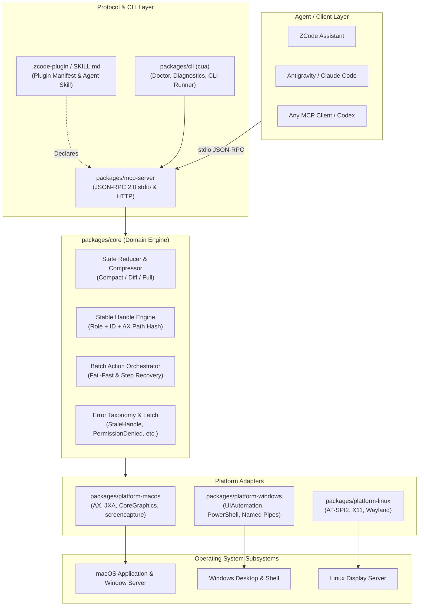

# System Architecture: zcode-desktop-control

`zcode-desktop-control` is a modular, local-first Computer Use runtime engineered for AI agents, featuring first-class Model Context Protocol (MCP) and ZCode plugin compatibility.

---

## 1. High-Level Architecture Overview

---

## 2. Core Subsystems

### A. Core Engine (`packages/core`)
- **Stable Element Handles**: UI element indices (`index: 12`) fluctuate across dynamic app repaints. The stable handle engine computes content-addressable identifiers (`h_<role>_<hash>`) based on `window_id + role + name + accessibility_path`, ensuring commands target the correct control even after UI updates.
- **State Compression & Token Efficiency**: Raw accessibility trees from complex applications can consume tens of thousands of tokens. The reducer provides `compact` mode (default, pruning non-interactive containers) and `diff` mode (only modified nodes since the last `state_id`).
- **Error Taxonomy**: Distinct error classes (`PermissionDeniedError`, `ElementNotFoundError`, `StaleHandleError`, `WindowNotFoundError`, `TimeoutError`) enable intelligent agent self-recovery rather than generic failures.

### B. MCP Server (`packages/mcp-server`)
- Pure, newline-delimited JSON-RPC 2.0 implementation over stdio or HTTP.
- Exposes 30+ standardized Computer Use tools with schema validation.
- Maintains strict stdio stream cleanliness: stdout is reserved solely for JSON-RPC messages; all diagnostic traces route to stderr.

### C. Platform Adapters
- **macOS (`packages/platform-macos`)**: Accessibility-first semantics using macOS JXA and System Events; CoreGraphics event dispatch; native `screencapture` integration.
- **Windows (`packages/platform-windows`)**: Windows UI Automation (UIA) and PowerShell process management.
- **Linux (`packages/platform-linux`)**: AT-SPI2 and X11/Wayland accessibility integration.
