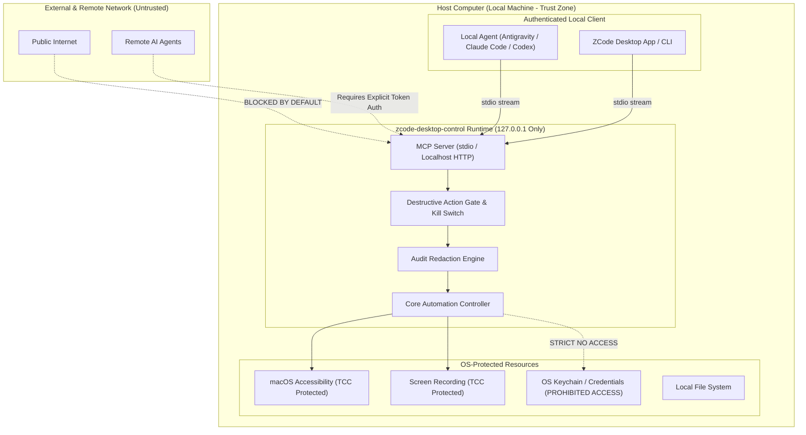

# Security Model & Trust Boundaries

`zcode-desktop-control` possesses high system privileges (UI inspection, synthetic keyboard and mouse input, screen capture). This document formalizes its security architecture and boundary enforcement.

---

## 1. Trust Boundaries Diagram

---

## 2. Security Invariants

### 1. Local-Only by Default
- The MCP server communicates strictly over local standard I/O (`stdio`).
- Any optional HTTP daemon binds exclusively to `127.0.0.1`. It never listens on `0.0.0.0` or public network interfaces without explicit user authorization and dynamic token authentication.

### 2. Zero Secret Harvesting & Zero Cookie Extraction
- The runtime explicitly **forbids** accessing web browser cookies, session stores, or saved password databases.
- The runtime does not attempt to dump the macOS Keychain or Windows Credential Manager.

### 3. Secret Redaction in Logs & State
- State trees and diagnostic logs pass through an automatic redaction filter.
- Password input fields (`secureTextField`, `AXSecureTextField`) have their text contents replaced with `[REDACTED_PASSWORD]`.
- API keys, Bearer tokens, and sensitive authorization headers are scrubbed before logging.

### 4. Emergency Kill Switch (`stop_computer_control`)
- At any moment during an automated workflow, an agent or human operator can trigger `stop_computer_control`.
- The runtime immediately revokes any active synthetic events, drops pending action queues, and terminates state locks.

### 5. Destructive Action Guardrails
- Operations involving system deletion (`rm -rf`, emptying trash), financial transactions, or system configuration modification are flagged. Agents are instructed via skill prompts to request explicit user confirmation prior to execution.

### 6. No Telemetry or Call-Home
- `zcode-desktop-control` contains zero analytics trackers, telemetry reporters, or external network call-home probes.
